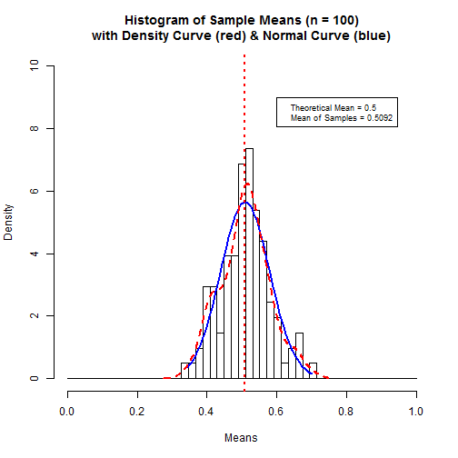

SDevelop Data Products Sample Means App
========================================================
author: Jack Jackson
date: 15 May 2015

Overview of the App
========================================================

Purpose: Demonstrate the result of simulating a number of random samples drawn from exponentially distrubuted data focusing on the distribution of the sample means as the number of samples increases.

- Displayed is a plot of sample means.
- Sample data is exponential with a rate parameter of 2.
- Sample size for each sample is 40.
- The user can select the number (10 to 2000) of samples.
- The user can animate the display to see the incremental effect of adding more samples.

Link: https://montereybayjack.shinyapps.io/DevDataProd-project

Simulation & Sample Plot
========================================================
left: 50%
Simulation Code:

```r
ns <- 2000; ss <- 40
lambda <- 2
sample <- vector(mode="numeric", length=0)
xbar <- numeric(ns)
for (s in 1:ns) {
  sample <- rexp(ss, lambda)
  xbar[s] <- mean(sample)
}
```
***
Plot of First 100 Samples:
 

Reactive Control: Animated Slider
========================================================

- The control button (bottom right) toggels between 'play' and 'pause'.
- The slider ranges from 10, 20, ..., 2000 samples.


- Click on the slider's 'play' control to progressivley add samples.
- Click on the slider's 'pause' control to halt play. 
- Adjust the slider manually to select the number of samples.


App Description
========================================================

This app shows the results of simulating an increasing number of samples of 40 random exponentially distrubted numbers with an arrival rate (lambda) of 2. The number of samples ranges from 10 to 2000.

Displayed is a histogram of the sample means with the density curve (in red) of the set of sample means and the theoretical normal curve (in blue) producted by the central limit theorem for a sufficiently large number of samples. The mean of the samples is also depicted in red.

Increasing the number of sample means shown adds more samples to the plot. Refreshing the display produces an entirely different set of random samples.
